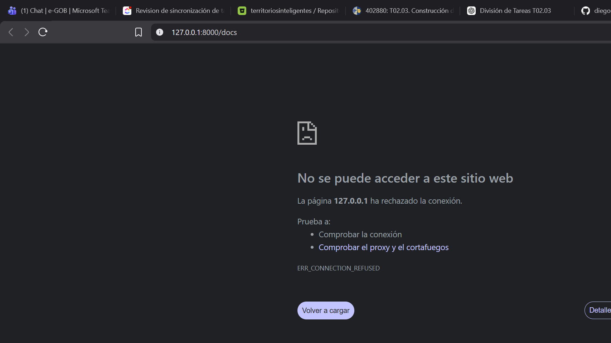

# SISMED UPS - Sistema de Gestión Médica

Backend académico del sistema de gestión médica SISMED UPS, desarrollado con **FastAPI** y **SQLite (SQLAlchemy)**.  
Incluye funcionalidades administrativas de caja y comprobantes de venta.

## Estructura del proyecto

```
app/
├── main.py                  # Punto de entrada de la aplicación
├── database.py              # Configuración de base de datos SQLite
├── models/                  # Modelos SQLAlchemy
│   ├── paciente.py
│   ├── medico.py
│   ├── cita.py
│   ├── consulta_medica.py
│   ├── comprobante_venta.py
│   └── transaccion_caja.py
├── schemas/                 # Esquemas Pydantic
│   ├── paciente.py
│   ├── medico.py
│   ├── cita.py
│   ├── comprobante_venta.py
│   └── transaccion_caja.py
├── repositories/            # Capa de acceso a datos
│   ├── paciente.py
│   ├── medico.py
│   ├── cita.py
│   ├── consulta_medica.py
│   ├── comprobante_venta.py
│   └── transaccion_caja.py
├── services/                # Lógica de negocio
│   ├── exceptions.py
│   ├── paciente.py
│   ├── medico.py
│   ├── cita.py
│   └── administrativo.py
└── routers/                 # Endpoints de la API
    ├── paciente.py
    ├── medico.py
    ├── cita.py
    └── administrativo.py
```

## Integrantes

| Integrante | Rol |
|---|---|
| Diego Bravo | Desarrollador |
| Rafael Serrano | Desarrollador |
| Ariel Paltan | Desarrollador |

## Requisitos

- Python 3.10+

## Instalación

```bash
python -m venv venv
venv\Scripts\activate      # Windows
source venv/bin/activate   # Linux/Mac

pip install -r requirements.txt
```

## Ejecución

```bash
uvicorn app.main:app --reload
```

La API quedará disponible en `http://127.0.0.1:8000`.

## Endpoints implementados

### Módulo Administrativo (Caja y Comprobantes)

| Método | Endpoint | Descripción |
|---|---|---|
| POST | `/admin/comprobantes/` | Registrar un comprobante de venta |
| GET | `/admin/comprobantes/` | Listar todos los comprobantes |
| POST | `/admin/caja/ingresos` | Registrar un ingreso de caja |
| POST | `/admin/caja/egresos` | Registrar un egreso de caja |
| GET | `/admin/caja/ingresos` | Consultar ingresos por rango de fechas |

### Otros módulos

| Método | Endpoint | Descripción |
|---|---|---|
| POST/GET | `/pacientes/` | CRUD de pacientes |
| POST/GET | `/medicos/` | CRUD de médicos |
| POST/GET | `/citas/` | Gestión de citas médicas |

## Documentación interactiva (Swagger)

- Swagger UI: `http://127.0.0.1:8000/docs`
- ReDoc: `http://127.0.0.1:8000/redoc`

### Evidencias



Esquema OpenAPI guardado en [`swagger_evidencia.json`](swagger_evidencia.json).

## Enlace del repositorio

[https://github.com/diegobravo10/Grupo03_SISMED_UPS.git](https://github.com/diegobravo10/Grupo03_SISMED_UPS.git)

## Conclusiones

El desarrollo del módulo administrativo de caja y comprobantes para el sistema SISMED UPS permitió implementar una solución robusta para la gestión de transacciones financieras en un entorno clínico. Utilizando FastAPI como framework y SQLAlchemy como ORM, se logró una arquitectura limpia separada en capas (modelos, esquemas, repositorios, servicios y rutas), lo que facilita el mantenimiento y la escalabilidad del sistema.

Se implementaron exitosamente cinco endpoints que cubren las operaciones fundamentales: registro de comprobantes de venta con generación automática de asientos de ingreso, listado de comprobantes, registro independiente de ingresos y egresos de caja, y consulta de ingresos por rango de fechas. La validación de reglas de negocio, como la coherencia entre subtotal, IGV y total en los comprobantes, garantiza la integridad de los datos financieros.

El uso de SQLite como base de datos demostró ser adecuado para un proyecto académico, ofreciendo simplicidad en la configuración sin sacrificar funcionalidad. La documentación interactiva generada automáticamente por Swagger facilita la exploración y prueba de la API. Este proyecto sienta las bases para futuras expansiones como la generación de reportes financieros, integración con sistemas contables y autenticación de usuarios.
